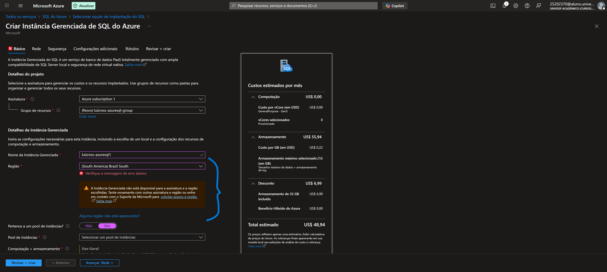
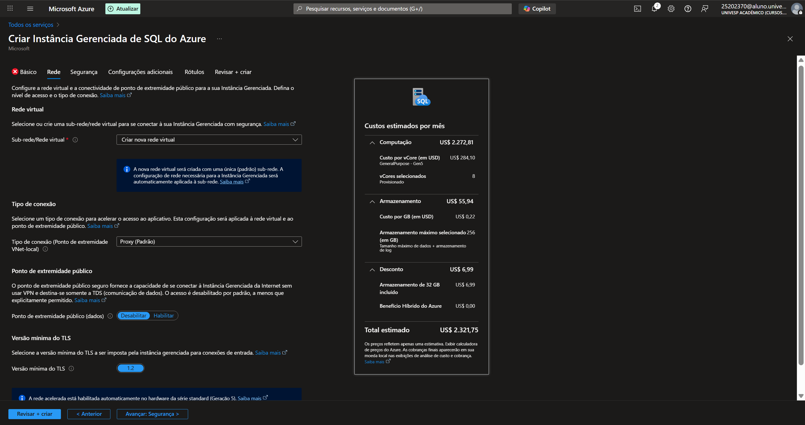
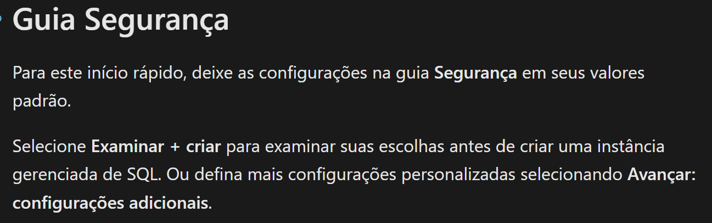

# Azure-VM
estudo introdutório para serviços em nuvem - Configurando Instância Gerenciada de SQL do Azure

## Estudo teórico e prático¹ sobre Instâncias Gerenciadas de SQL do Azure
> ¹: devido ao bloqueio das regiões disponíveis para criação da instância,
>    doravante explicitada em imagens, não foi possível executar efetivamente o recurso

- Passo a passo executado conforme documentação oficial, encontrada em: [link](https://learn.microsoft.com/pt-br/azure/azure-sql/managed-instance/instance-create-quickstart?view=azuresql&tabs=azure-portal)

### Apresentação e diferenciação das Instâncias de SQL do Azure
No momento deste estudo (16/ago/2025), a oferta de plano gratuito outrora disponível não se encontra mais ativa, o que impossibilitou a criação da instância para fins de laboratório. No entanto, compensarei com o máximo de informações acerca de sua finalidade e os compararei, SQL x SQL do Azure.

1. A Instância SQL do Azure
Segundo a documentação deste recurso:
>"[...]Instância Gerenciada de SQL, um mecanismo de banco de dados de plataforma
> como serviço (PaaS) totalmente gerenciado que identifica a maior parte das
> funções de gerenciamento de banco de dados, como atualização, 
> aplicação de patch, backups e monitoramento, sem o envolvimento do usuário."

2. Em relação às diferenças entre uma instância tradicional de SQL:

>"(Este recurso) se beneficia de estar sempre atualizada na nuvem, o que significa que alguns 
> recursos do SQL Server podem estar obsoletos, desativados ou ter alternativas. 
> Há casos específicos em que as ferramentas precisam reconhecer que um recurso específico 
> funciona de uma maneira um pouco diferente ou que o serviço está sendo executado em um ambiente 
> que você não controla totalmente.
>
> Algumas das principais diferenças:
>
> * A alta disponibilidade é incorporada e pré-configurada usando tecnologias semelhantes às de grupos de disponibilidade Always On.
> * Há apenas backups automatizados e restauração pontual. Os clientes podem iniciar backups do copy-only que não interferem na cadeia de backups automáticos.
> * Como não há suporte para a especificação de caminhos físicos completos, todos os cenários correspondentes devem receber suporte de maneira diferente: RESTORE DB não é compatível com WITH MOVE, CREATE DB não permite caminhos físicos, BULK INSERT funciona apenas com blobs do Azure, etc.
> * A Instância Gerenciada de SQL dá suporte à autenticação do Microsoft Entra e à Autenticação do Windows para entidades de segurança do Microsoft Entra (visualização).
> * A Instância Gerenciada de SQL gerencia automaticamente o grupo de arquivos XTP e os arquivos para bancos de dados que contêm objetos OLTP in-memory.
> * A Instância Gerenciada de SQL oferece suporte ao SQL Server Integration Services (SSIS) e pode hospedar um catálogo SSIS (SSISDB) que armazena pacotes SSIS, mas estes são executados em um Azure-SSIS Integration Runtime (IR) gerenciado no Azure Data Factory. Confira Criar Azure-SSIS IR em um Data Factory. Para comparar os recursos do SSIS, confira Comparar o Banco de Dados SQL com a Instância Gerenciada de SQL.
> * A Instância Gerenciada de SQL dá suporte à conectividade somente por meio do protocolo TCP. Ela não oferece suporte à conectividade por meio de pipes nomeados.
> * Você pode parar e iniciar a instância para economizar em custos."

## Passo 1
* Iniciando criação de uma nova Instância do SQL do Azure - Configurações básicas

## Passo 2
* Configurações de rede

## Passos seguintes
* Ademais, o tutorial recomenda deixar as configs como da Aba 'Segurança' em seus valores padrão, alterando-os após a criação do recurso

> Obrigado pela visita! Acesse meu linktree em: [Links úteis](https://ross-lh.github.io/linktree)